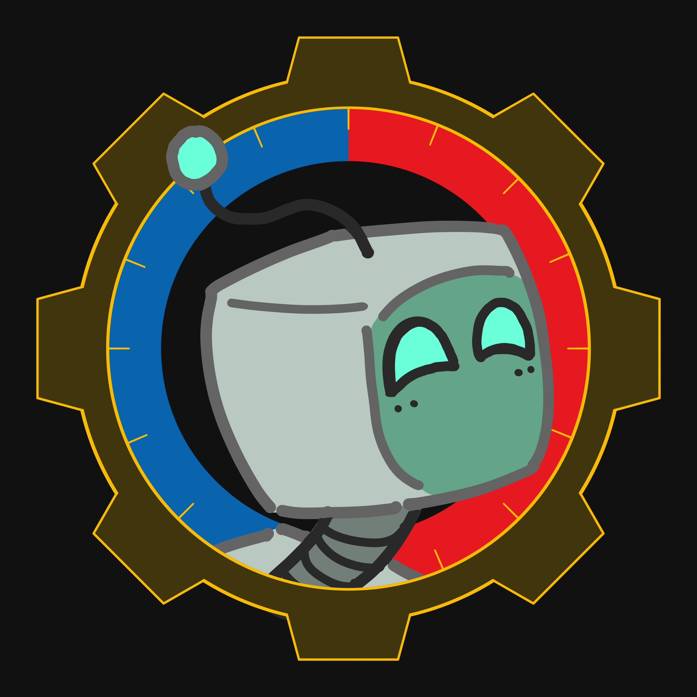
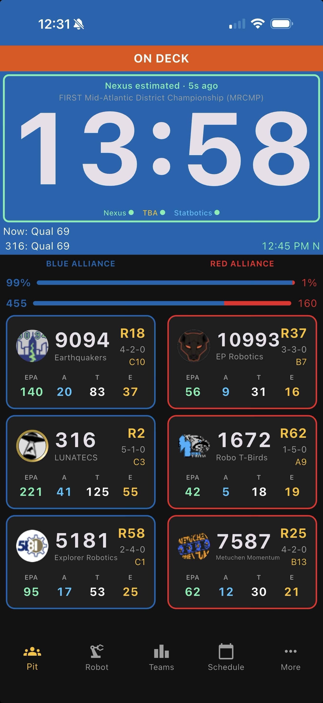
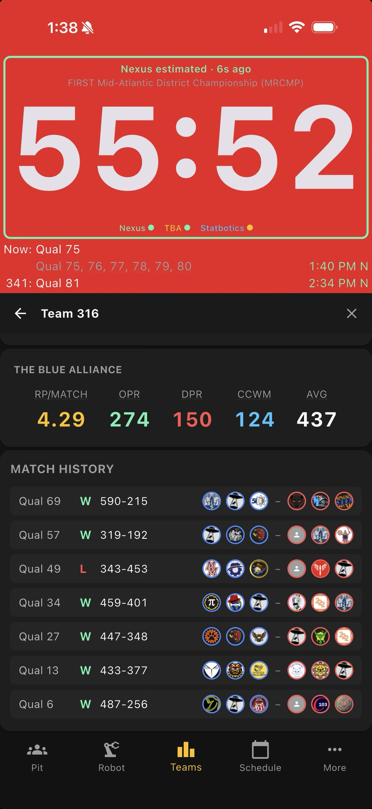
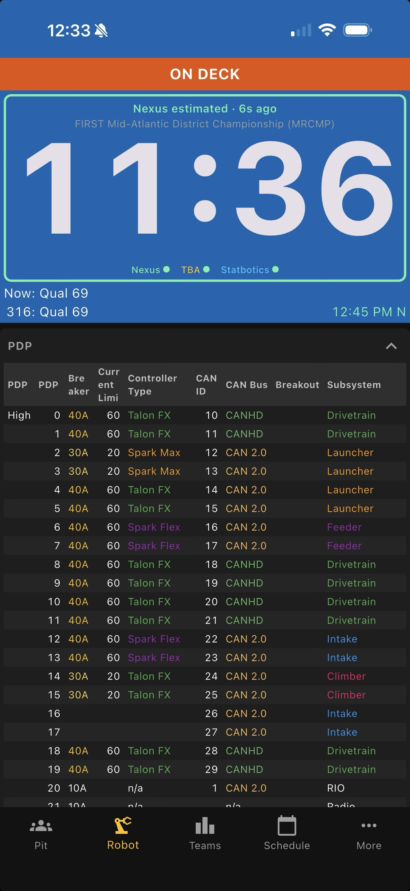
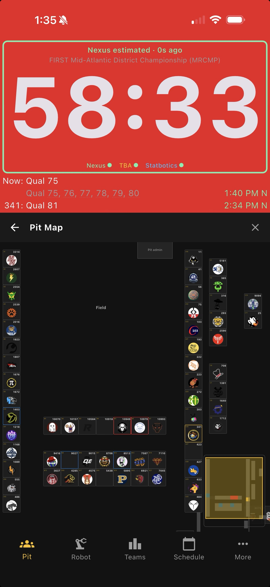

<table>
<tr>
<td width="180" valign="top" align="center">
   
  <h1>Pit Dash</h1>
</td>
<td valign="top">

Pit Dash is an app that shows your team's match countdown, alliance info, queuing status, and rankings on a phone or tablet at the pit.

**iPhone:** The iOS version is available via Apple TestFlight at [testflight.apple.com/join/gFvpXsbM](https://testflight.apple.com/join/gFvpXsbM).

**Android:** Android installation instructions are below.

If you encounter any issues or have suggestions for improvement, please create a new [Issue](../../issues).

</td>
</tr>
</table>

## Screenshots

  
  &nbsp;
  
  &nbsp;
  
  &nbsp;
  
  &nbsp;
  
  &nbsp;
  

Tap any screenshot for a description and full-resolution view.

## Installing

1. Go to the [Releases](../../releases) page and download the latest `.apk` file onto your Android device
2. Open the file from Downloads or the notification tray
3. When prompted about unknown sources, tap **Settings** and enable "Allow from this source"
4. Go back and tap **Install**

Android requires this "unknown sources" step for any app that didn't come from the Play Store. You can turn the setting back off after installing.

If your device blocks the install entirely, go to **Settings → Apps → Special access → Install unknown apps** and enable it for Chrome or whichever app you're opening the file from.

## Setup

The app walks you through initial configuration. You'll need a team number and a TBA API key (free at [thebluealliance.com/account](https://www.thebluealliance.com/account)).

A Nexus API key (free at [frc.nexus](https://frc.nexus)) is also recommended. Most events have a Nexus volunteer running Field Monitor, which gives the app real-time field timing and queuing banners (QUEUING SOON → NOW QUEUING → ON DECK → ON FIELD). The countdown is significantly more accurate with Nexus data.

The app auto-detects your event based on the date. The More menu (bottom right) lets you switch events manually.

## Limitations

- **No auto-update.** Check the [Releases](../../releases) page for new builds. You'll need to download and reinstall manually.
- **Android polish is in progress.** Some rough edges are expected.
