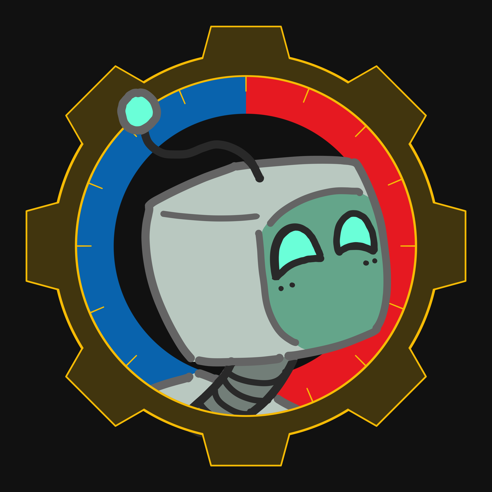
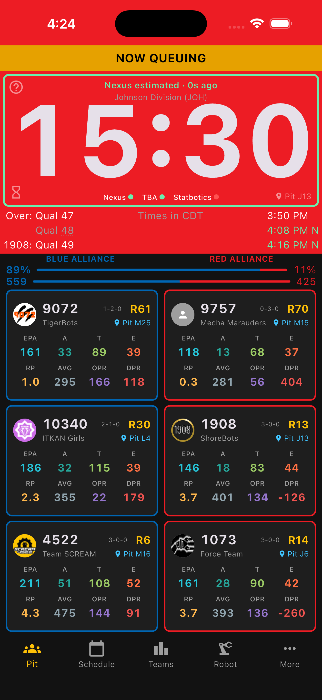
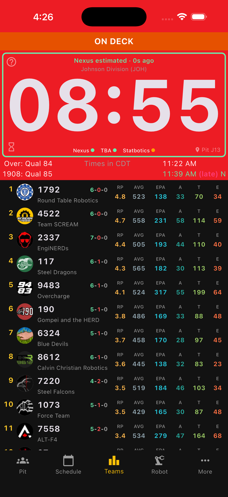
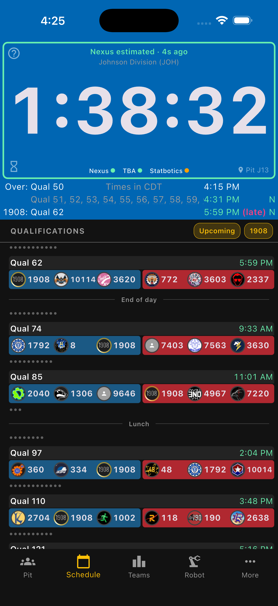
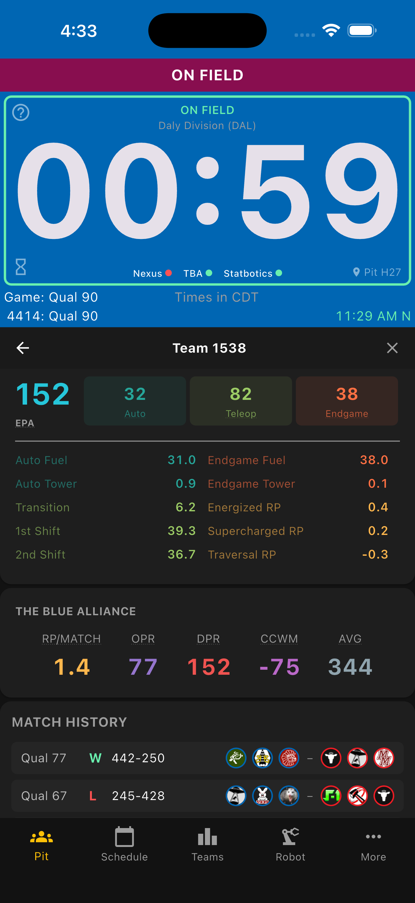
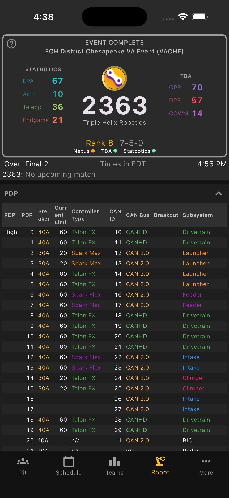
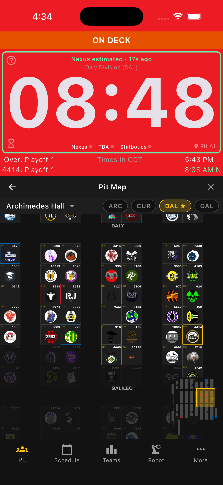

<table>
<tr>
<td width="180" valign="top" align="center">
   
  <h1>Pit Dash</h1>
</td>
<td valign="top">

Pit Dash is a match-day companion for FRC teams. It shows your next-match countdown, alliance partners and opponents, live queuing status, win probabilities, event rankings, the pit map, and the rest of the schedule — on a phone or a tablet, with multi-pane layouts when you have the screen for it.

**iPhone / iPad:** The iOS version is available via Apple [App Store](https://apps.apple.com/us/app/pit-dash/id6761343496).

**Android:** Android installation instructions are below.

If you encounter any issues or have suggestions for improvement, please create a new [Issue](../../issues).

</td>
</tr>
</table>

## Screenshots

  
  &nbsp;
  
  &nbsp;
  
  &nbsp;
  
  &nbsp;
  
  &nbsp;
  

Tap any screenshot for a description and full-resolution view.

## What you get

- **Pit screen** — match countdown, alliance cards for partners and opponents, Nexus queuing banners (`QUEUING SOON` → `NOW QUEUING` → `ON DECK` → `ON FIELD`), and a Statbotics win-probability bar for the upcoming match.
- **Schedule** — qualifications, playoffs, and finals; filter to just your team's matches or browse the whole event, including matches already played.
- **Teams & rankings** — live event rankings with W-L-T, RP average, average score, and Statbotics EPA broken out by Auto / Teleop / Endgame.
- **Team detail** — match history, OPR/DPR/CCWM, awards, and YouTube links for each match. Reachable from any team card, ranking row, pit-map cell, or schedule entry.
- **Pit map** — interactive, pinch-to-zoom map of the venue with your team and your upcoming-match opponents highlighted.
- **Robot tab** — pulls a Google Sheet your team controls (wiring, setpoints, auto routines, pit-crew checklists — whatever's useful) and renders each section as its own collapsible tile.
- **Tablet layouts** — on iPad and larger Android tablets, multiple views can be shown side-by-side.
- **Off-season / between events** — when you're not at a live event the app shows season EPA, W-L record, and per-event results.

## Screenshot gallery

A cross-section of how information is presented on phone and tablet.

### iPhone

  
  &nbsp;
  
  &nbsp;
  
  &nbsp;
  

  
  &nbsp;
  
  &nbsp;
  
  &nbsp;
  

### iPad

  
  &nbsp;
  
  &nbsp;
  

  
  &nbsp;
  

## Installing

1. Go to the [Releases](../../releases) page and download the latest `.apk` file onto your Android device
2. Open the file from Downloads or the notification tray
3. When prompted about unknown sources, tap **Settings** and enable "Allow from this source"
4. Go back and tap **Install**

Android requires this "unknown sources" step for any app that didn't come from the Play Store. You can turn the setting back off after installing.

If your device blocks the install entirely, go to **Settings → Apps → Special access → Install unknown apps** and enable it for Chrome or whichever app you're opening the file from.

## Setup

The app walks you through initial configuration. You'll need a team number and a TBA API key (free at [thebluealliance.com/account](https://www.thebluealliance.com/account)).

A Nexus API key (free at [frc.nexus](https://frc.nexus)) is also recommended. Most events have a Nexus volunteer running Field Monitor, which gives the app real-time field timing and queuing banners (QUEUING SOON → NOW QUEUING → ON DECK → ON FIELD). The countdown is significantly more accurate with Nexus data.

Statbotics data (EPA, win probabilities) is pulled automatically with no key required. The Robot tab is optional and points at a public Google Sheet your team owns.

The app auto-detects your event based on the date. The More menu (bottom right) lets you switch events manually.

## Limitations

- **No auto-update on Android.** Check the [Releases](../../releases) page for new builds. You'll need to download and reinstall manually.
- **Android polish is in progress.** Some rough edges are expected.
