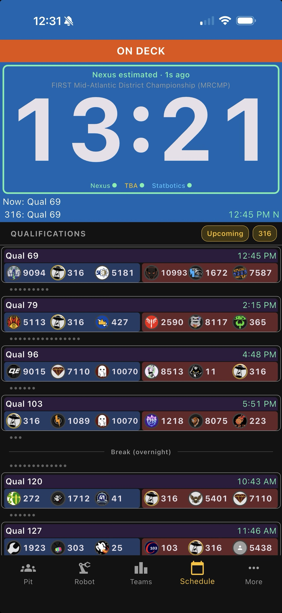

# Schedule

[← Back to README](../../README.md)

The event schedule. By default it shows **upcoming matches involving your team**, but you can also look back at past matches or switch to any other team at the event.

- Covers **qualifications, playoffs, and finals** — once each phase is published, those matches appear here automatically.
- Each row shows the match number, scheduled time, and all six team avatars/numbers. Your team is highlighted.
- **`Upcoming` pill** toggles between showing only upcoming matches and showing the full schedule (including matches already played).
- **Team pill** (e.g. `316`) toggles between filtering to just your team's matches and showing every team's matches.
- Overnight gaps and lunch breaks are called out so it's obvious when the field goes cold.
- Tap any match to see alliance details and predictions.

