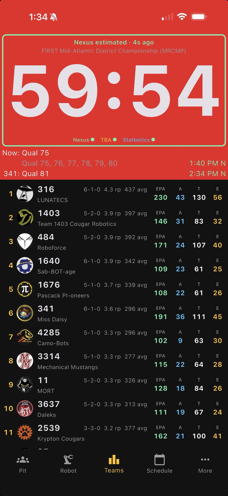

# Teams & Rankings

[← Back to README](../../README.md)

Live event rankings with the stats that actually matter for scouting and alliance selection.

- **Rank, team, and name** on the left.
- **Record** (W-L-T), **ranking points average**, and **average score** in the middle.
- **Statbotics EPA breakdown** on the right — overall EPA plus Auto / Teleop / Endgame components.
- Tap any row to drill into that team's detail page (awards, event history, match-by-match performance).

